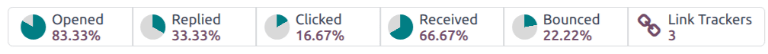

===============================
Analyze email marketing metrics
===============================

.. |CTR| replace:: :abbr:`CTR (Click through rate)`

In order to properly understand the success or failure of an email marketing campaign, it is
necessary to monitor several key metrics. The insights gained from these metrics can then be used to
optimize future campaigns. Odoo's *Email Marketing* application tracks several :ref:`key metrics
<email-marketing/key-metrics>`, that can be interpreted to improve future campaigns.

.. _email-marketing/key-metrics:

Key metrics
===========

The following metrics are tracked in Odoo's *Email Marketing* application, and can be used to help
gauge the success of an email marketing campaign.

.. tabs::

   .. tab:: Opened

      The *Opened rate* measures the number of emails that were opened by recipients again the total
      number that were delivered. A high open rate can indicate the subject line was compelling, and
      was successful in enticing recipients to engage with content.

   .. tab:: Replied

      The *Replied rate* measures the number of recipients who responded to the messages directly.
      This metric provides insight into the level of engagement and interaction with the email
      content. A high reply rate can indicate that the email resonated with recipients, prompting
      them to take action, or provide feedback.

   .. tab:: Clicked

      *Click through rate*, |CTR|, measures the percentage of recipients who clicked on one or more
      links within the email. A higher |CTR| suggests that the message's content is relative, and
      appropriately targeted, to the recipient. It can also indicate the strength of any calls to
      action that were included in the message.

   .. tab:: Received

      *Received rate* measures the number of messages that were successfully delivered against the
      number that were sent in total. This can be used to judge the integrity of an email list, and
      the quality of the contacts. A low received rate can indicate the email addresses in a list
      are out-of-date, or incorrect. At the same time, if a message has a high received rate, but
      other metrics such as |CTR|, replied, or opened are low, it indicates that the addresses are
      accurate, but the messages themselves are not connecting with recipients.

   .. tab:: Bounced

      *Bounced rate* measures the number of messages that were unsuccessfully delivered, against the
      number that were sent in total. Similarly to *received rate*, this metric can be used to
      judge the integrity of the addresses on an email list, and can be used to indicate quality
      issues. A higher bounced rate suggests the list may be out-of-date, or the addresses are
      incorrect.

View mail metrics
=================

After a mass mail has been sent, the results for that particular mailing are displayed in multiple
locations.

To access the metrics for an individual mailing, navigate to :menuselection:`Email Marketing app
--> Mailings`. Locate the specific mailing in the list view, and use the column headings to view the
results for that mailing. Click on one of the mailings in the list to open a detailed record. At the
top of the record, detailed metrics are displayed as smart buttons.

.. seealso::
   More information on creating, customizing, and managing campaigns, checkout the :ref:`Mailing
   campaigns <email_marketing/mailing-campaigns>` documentation.

Analyze metrics
===============

In order to gather insights from the :ref:`key metrics <email-marketing/key-metrics>` tracked on a
campaign, it is important to understand what the results indicate.

Individual metrics
------------------

Opened rate
~~~~~~~~~~~

A high open rate indicates that the subject line was compelling, and successfully prompted the
recipients to engage with the message. It suggests the subject was relevant and grabbed the
recipients' attention.

A low open rate may indicate the subject line failed to capture the recipients' interest. It can
also mean the email ended up in a spam or junk folder.

Replied rate
~~~~~~~~~~~~

A high replied rate signifies the email resonated with recipients, prompting them to take action or
provide feedback. This implies strong engagement and interest from recipients. A low replied rate
may suggest that the message lacked relevance or did not contain a clear call to action.

Clicked rate
~~~~~~~~~~~~

A high |CTR| can indicate the email content was relevant and appropriately targeted. Recipients were
motivated to click on the links provided, and found the content engaging.

A low |CTR| may suggest issues with either the targeting, or the content itself. Recipients may have
been unmotivated by the calls to action, if there were any, or the message itself may have been
directed towards the wrong audience.

Received rate
~~~~~~~~~~~~~

As received rates track the number of successful delivered messages against the total number of sent
messages, this metric can be used to measure the quality of the mailing list used in a campaign. A
high received rate indicates the mailing list contains relevant and update to date contact
information, while a low received rate should be a sign that the list needs some work if it is to be
used again.

Bounced rate
~~~~~~~~~~~~

Similarly to received rate, bounced rate can be used to measure the quality of the mailing list used
in a campaign. In this case, a high bounce rate indicates potential issues with the quality or
accuracy of the email list. It may indicate that there are many invalid or outdated email addresses
on the list.

Combining metrics
-----------------

To gain a more well rounded understanding of the results of a campaign, it is helpful to look at
multiple metrics at once. Below are a few sample combinations of metric results, and how they may
be interpreted.

.. tabs::

   .. tab:: High opened rate with high CTR

      This combination indicates that the subject line was compelling enough to encourage recipients
      to open the email, and the content was engaging and relevant, leading to a high |CTR|. It
      suggests that the email campaign effectively captured recipients' attention and motivated them
      to take action.

   .. tab:: Low opened rate with high replied rate

      This combination suggests that although the subject line may not have been highly compelling,
      the email content resonated strongly with recipients who did open it, prompting them to
      respond directly. It indicates that while the email may not have been widely opened, it
      successfully engaged those who did open it. This combination of results indicates that
      efforts should be made to improve the subject lines on future messages.

   .. tab:: High received rate with low opened rate and low CTR

      This combination suggests that the majority of messages were successfully delivered to
      recipients' inboxes (high received rate), but a low percentage of recipients actually opened
      the emails (low open rate) and clicked on the links within (low |CTR|). It indicates that
      while the email list is relatively clean and up-to-date, the email content or subject lines
      may not be effectively capturing recipients' interest or motivating them to engage. This
      combination highlights the need for improvement in email content, subject lines, or targeting
      strategies to increase engagement despite a clean email list.
